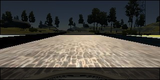
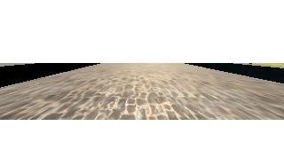
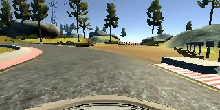
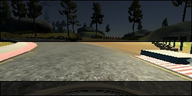
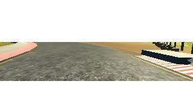
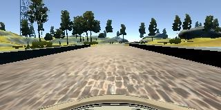
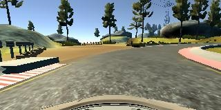
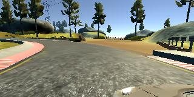
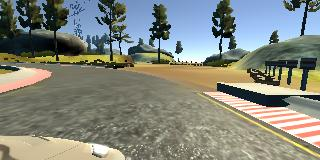

# **Behavioral Cloning**

The goal of this project is to understand behavioral cloning by building convolution neural network in Keras to predict steering angles based on the frames captured from the camera mounted on center of windshield. The trained model is used to drive around a test track in simulation. This document describes the approach used and results.

## Model Architecture

To start with, basic LeNet architecture was implemented. After playing with it for few times, it could steer car pretty straight. But it failed to keep on the road on a very sharp turn. Also, driving over the bridge was tricky, car was oscillating left and right. 

As LeNet was not proving good, I decided to try new architecture - <a href="http://images.nvidia.com/content/tegra/automotive/images/2016/solutions/pdf/end-to-end-dl-using-px.pdf">Nvidia CNN Architecture</a>. This model consists of 5 convolutional layers and 3 fully connected layers. Convolutional layers perform feature extraction and fully connected layers then derive the steering angle. LeNet is a classification network whereas Nvidia CNN is a regression network. Final model looks like this:

| Layer                    | Description                           |
|:-------------------------|:--------------------------------------|
| Input                    | 320x65x3 preprocessed image           |
| Convolution 24@158x31    | 5x5 stride, RELU activation           |
| Convolution 36@77x14     | 5x5 stride, RELU activation           |
| Convolution 48@37x5      | 5x5 stride, RELU activation           |
| Convolution 64@35x3      | 3x3 stride, RELU activation           |
| Convolution 64@33x1      | 3x3 stride, RELU activation           |
| Flatten                  | outputs 2112                          |
| Dense 100                | Fully connected, Linear/No activation |
| Dense 50                 | Fully connected, Linear/No activation |
| Dense 10                 | Fully connected, Linear/No activation |
| Dense 1 (steering angle) | Fully connected, Linear/No activation |

Before running image through model, it was preprocessed. Every image is converted to BGR format, then lambda layer normalizes it, and it's top 70 and bottom 25 pixels were cropped. So, input BGR image 320x160x3 was converted to 320x65x3 normalized image. 

| Original image                                         | Cropped area                                               | Cropped output                                             |
|:-------------------------------------------------------|:-----------------------------------------------------------|:-----------------------------------------------------------|
|  |  |  |
|  |  |  |

For the first 5 epochs validation loss was decreasing, but after that it pretty much remained same. This means model was overfitting. So, final model has just 5 epochs. Also, to reduce overfitting different training and validation data is used. Dataset was shuffled and split to 80-20 training-validation data.

Learning rate is not tuned manually, model uses Adam optimizer. Mean Squared Error (MSE) is used as loss function. Trained model was saved to "model.h5" file.

## Training Strategy

For training, I used dataset provided by Udacity. It has total of 8036 image from each camera - center, left and right. These images are in BGR format, but while running in simulation mode, each frame comes in RGB format. So, for training also these BGR images were converted to RGB format to keep consistency of input.

For augmentation, each image was flipped and angles were modified accordingly. So, resultant dataset has equal number of left turn and right turn images. After augmentation, we have 16072 images from each camera.

| Original image                                         | Flipped image                                             |
|:-------------------------------------------------------|:----------------------------------------------------------|
|  |  |
|  |  |

The simulator captures images from three cameras mounted on the car - center, left and right camera. Left and right camera images are useful to keep the car in the center of the road. While driving in autonomous mode only center camera is used. So, if car deviates from the center of the road, images captured from center camera would look like images captured from left/right camera in simulation. In such case, we need to correct the steering angle to steer car to the center of road again. Correction of +/-0.4 was used in final dataset. If this correction is very less, at high speed car drives off the road. And if it is very high, car oscillates left right.

| Left Camera Image                                  | Center Camera Image                                     | Right Camera Image                                    |
|:---------------------------------------------------|:--------------------------------------------------------|:------------------------------------------------------|
|  |  |  |
|  |  |  |

So, after using images from all three cameras and flipping it, final dataset consists of 48216 images, in which 11025 images are of left and right turn each, and 26166 images are of straight driving. This dataset was shuffled and out 48216 images, 80% images were used for training and 20% images were used for validation.

## Results

To test the model, images form dataset were not used. Instead model was used to drive the car autonomously in the simulator. Following GIFs show snippet from actual test run:

| Inside Camera View                                                       | External Camera - Top View                                       |
|:------------------------------------------------------------------------:|:----------------------------------------------------------------:|
|  |  |

As you can see, car could drive autonomously around the track without leaving the road. Complete videos of the lap are stored in .mp4 files - "video_inside_camera_view.mp4" and "video_top_view.mp4".

